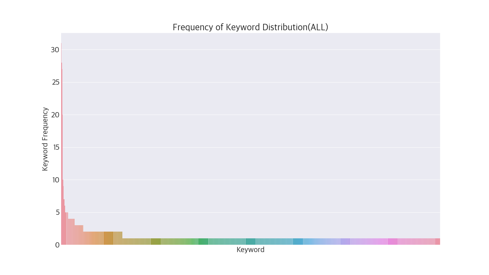
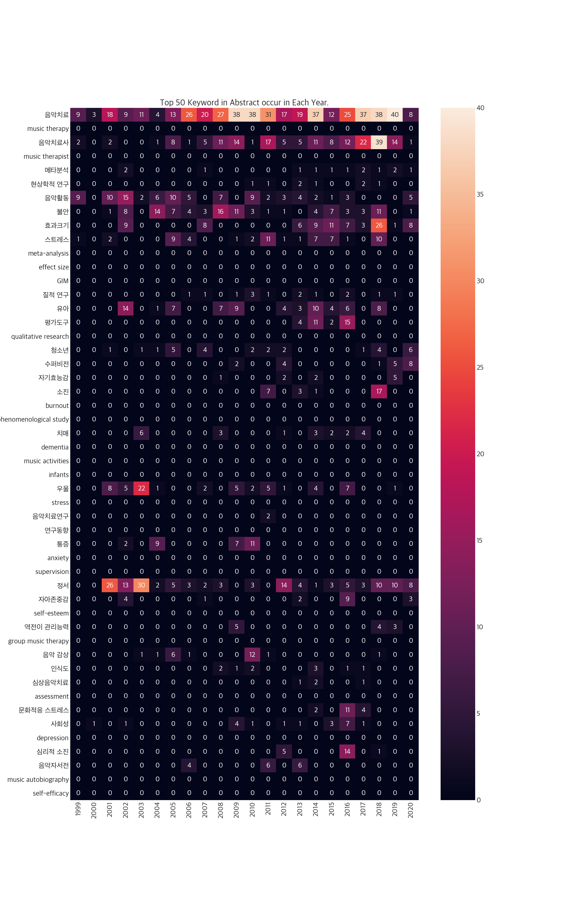
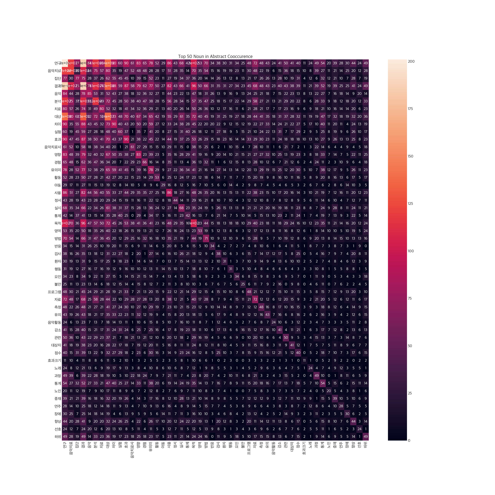

Music-Therapy-Article-NLP
============================

*해당 프로젝트는 2019년에 최초 수행되었음 2020년에 수정 및 정리되었습니다.*

# 1. Overview
한국음악치료학회지에서 발간된 논문을 수집하고, 논문의 초록과 키워드를 통해 "음악치료"의 연구주제를 살펴본다.

한국음악치료학회지의 초록을 주된 데이터를 하며, 자연어처리(토픽 모델링)를 통해 관련 학문 분야의 연구 주제를 파악한다.

결론적으로 음악치료사에 대한 학계의 관심이 2010년대 이후 증가한 것을 확인할 수 있으며 독자적인 토픽의 주제로서 간주될 정도로 성장하였다. 


**\[Tag\]** #크롤링 #논문 #초록 #NLP #토픽모델링 

# 2. Content

## 1. Data Crawling

크롤링을 위한 세팅. 크롬 브라우저 버전에 맞는 driver를 ./driver 폴더에 배치한다. ./data에 논문의 제목과 URL 정보가 매핑된 title-url.csv 저장되며, ./data/title-url.csv를 기반으로 article_raw.csv가 수집된다. 다음 명령으로 실행

```
$ python crawling_data.py
```

[RISS](http://www.riss.kr/search/detail/DetailView.do?p_mat_type=3a11008f85f7c51d&control_no=2a75a048a6856c25ffe0bdc3ef48d419)에서 한국음악치료학회에서 발간하는 한국음악치료학회지를 찾는다. 1999년부터 2019년(2020년)까지 발간된 모든 논문을 수집한다.

수집을 위해서는 Python 라이브러리 selenium과 beautiful soup를 활용한다. RISS 웹 사이트에서 동적 웹 사이트이므로 selenium을 활용하여 크롤링한다.

안전한 수집을 위해서 우선 논문의 제목과 URL 정보만을 크롤링한다. 개별 논문에 대한 크롤링은 수집합 URL 정보를 기반으로 이루어진다. 

개별 논무에 대해서 수집하는 정보는 다음과 같다.

|데이터|설명|비고|
|----|---|---|
|title|논문의 이름|비어있는 값 없음. 중복된 값도 있음|
|author|논문의 저자|여러 명 있음. 통일된 양식을 따리지 않음|
|organization|기관명||
|name|학회지 이름||
|volno|권호사항||
|year|발간 년도||
|language|발간 언어|한국어와 영어가 있으며 비어있는 값 있음|
|keyword|논문의 키워드|비어있는 값 있음|
|kdc|KDC 등재사항||
|kci|KCI 등재사항||
|media|매체||
|page|페이지 사항||
|citation|인용 사항||
|link|열람 링크||
|abstract|초록|비어있는 값 있음|
|location|소장기관||

## 2. Data Preprocessing

최초 크롤링한 데이터를 정제한다. 
다음 명령으로 실행

```
$ python preprocess_data.py
```

### 1. 저자
공백문자를 지우고 리스트로 정리

### 2. 권호사상
권 사항과 호 사항을 구분해서 따로 저장

### 3. 키워드
공백문자를 지우고 리스트로 정리

### 4. 페이지
시작 페이지와 끝 페이지를 나누어서 저장

### 5. 초록
공백문자를 지움

정리한 이후에 주요 데이터(키워드, 초록)의 비어있는 레코드를 카운트한 결과 키워드는 62 건, 초록은 65 건의 레코드가 비어있다.

비어있는 레코드를 제거하고 분석할 수도 있지만 정확한 분석을 위해 논문을 직접 찾아서 비어있는 값을 수작업으로 채운다. 수작업으로 데이터를 채우는 과정에서 중복된 값과 논문이 아닌 레코드(규약, 북 리뷰)가 있음을 파악했으며, 이를 제거할 필요성을 느꼈다.

## 3. Exploratory Data Analysis (EDA)

전체 데이터에 대한 개략적인 분포 파악 중심. 분석 결과 시각화 자료는 figure 폴더에 함수명으로 저장된다. 다음 명령으로 실행.

```
$ python eda.py
```

중복된 값(27건)과 논문이 아닌 레코드(6건)는 제외된 상태에서 분석을 수행한다.

### 1. 언어별 논문 수
언어별로 논문의 빈도 수를 파악한다.

|language|freq|
|--------|----|
|-|28|
|English|8|
|Korean|175|


한국학회지이므로 한국어로 된 논문이 압도적으로 많다. 표에 나타나느 -는 사실상 내용을 보면 한국어 자료이다. 

물론 영어로 된 논문도 간혹 있다. 한국어 자연어 처리를 위해서 영어 논문을 차후 제외하도록 한다.

### 2. 년도별 논문 발간 수
년도별로 발간된 논문의 수를 파악한다.

|year|freq||year|freq|
|----|----|-|---|----|
|1999|4||2010|12|
|2000|4||2011|13|
|2001|7||2012|9|
|2002|6||2013|11|
|2003|6||2014|10|
|2004|10||2015|8|
|2005|12||2016|14|
|2006|8||2017|11|
|2007|9||2018|15|
|2008|9||2019|14|
|2009|14||2020|5|


2010년대에 들어와서 많은 수의 논문이 발간되었다. 그래프 상으로 2020년에 논문 발간 수가 떨어진 것처럼 보이지만, 이는 현재 시점에서 추가될 수 있는 값이다.

2010년대 초반까지 꾸준한 성장 이후 하락세를 겪었으며 중반 이후에 회복한 것을 확인할 수 있다.

### 3. 논문별 키워드의 개수

각 논문에 할당된 키워드의 개수에 따른 빈도이다.

|# of keyword|freq||# of keyword|freq|
|------------|----|-|-----------|----|
|0|27||8|50|
|2|2||9|5|
|3|6||10|20|
|4|19||11|3|
|5|7||12|9|
|6|53||13|3|
|7|6||15|1|


하나에 논문에 6개와 8개의 키워드가 할당된 경우가 가장 많다.

### 4. 논문 초록 길이

논문 초록의 길이에 따른 빈도이다. 초록의 길이는 초록에 포함된 단어(띄어씌기 기준)에 개수를 바탕으로 계산하였다.


100단어 전후의 단어로 구성된 논문의 초록이 가장 많다.

<br>
자연어처리를 위해서 필요한 데이터만을 따로 추출한다. 논문이 아닌 것과 중복된 논문을 분석대상에서 제외한다. 또한 한국어 자연어처리이므로 영어 논문도 제외한다. 마지막으로 초록이 없는 논문에 대해서도 제외한다.

최종적으로 논문의 제목, 발행년도, 키워드, 초록 데이터만으로 구성한 파일을 별도로 만든다. 해당 파일은 자연어처리에 사용한다.

## 3. Basic NLP

KoNLPy 라이브러리를 사용해서 초록에서 명사를 추출한다. 키워드와 초록에 있는 자연어를 바탕으로 분석한다. 다음 명령으로 실행

```
$ python nlp.py
```

### 1. Keyword



전체적인 키워드 분포를 살펴보면 긴 꼬리의 그래프를 그리는 것을 확인할 수 있다. 따라서 상위 빈도의 키워드를 집중적으로 분석한다.


키워드에는 영문이 포함되어 있다. 또한 주제가 음악치료이므로 음악치료와 관련된 키워드가 상위에 위치한다.

키워드와 관련해서 연도별 변화 추이를 살펴본다.


히트맵을 통해서 연도별 키워드의 변화 추이를 확인할 수 있다. 키워드 "음악치료사"는 2000년대까지 주요한 키워드가 아니었지만 2010년대 이후로 주된 키워드가 되었다. 특히 2018년에 발간된 논문 중 8건의 논문이 음악치료사를 키워드로 선정하였다.


마지막으로 키워드의 공기빈도를 살펴본다. 공기빈도를 살펴보면 영어와 이를 해석한 한국어 키워드가 동시에 많이 나타났다. 

### 2. Abstract

초록에 있는 한국어 명사에 대해서 빈도를 분석한다. 초록에서 한국어 명사를 추출하기 위해 KoNLPy 라이브러리를 사용한다. Komoran 형태로 분석기를 사용했으며, 사용자 정의 사전을 통해 고유명사를 정의하였다. 또한 한 글자 단어는 분석에서 제외한다.


음악치료와 관련된 명사가 초록에 다수 포함되어 있다.


년도별 초록에 포함된 명사의 변화 추이이다. 음악치료사가 2010년대 이후로 초록에 많이 포함된 것을 알 수 있다. 또한 명사 노인이 2000년대가 2010년대에 비해 많이 언급되었다.



초록에 등장하는 단어가 아니라 초록에 등장하는 키워드에 빈도를 확인한다. 음악치료사 키워드의 증가를 확인할 수 있다. 또한 정서와 관련된 언급이 초록에 점차 줄어들었다.



초록에 등장하는 주요 명사 간 공기빈도이다.


초록에 등장하는 주요 키워드 간 공기빈도이다.

## 4. Topic Modleing

다음 명령으로 실행

```
$ python topic_modeling.py
```

LDA Topic Modeling을 통해서 초록의 주제를 파악해본다. LDA Topic Modleing의 결과를 시각화한 결과이다. [링크](./figure/topic_modeling.html)


11개의 토픽으로 나눈 결과이다. 토픽을 구성하는 단어를 기반으로 토픽을 해석하면 다음과 같다.

토픽 1은 음악치료 연구와 관련이 깊다. 특히 실험을 통해 음악치료 효과를 확인하는 논문 유형이라고 할 수 있다.

토픽 2는 음악치료 연구를 비롯하여서 음악치료사에 대한 내용이다. 최근들어 증가한 음악치료사에 대한 관심이 토픽 2를 형성하는데 영향을 주었다고 할 수 있다.

토픽 3은 음악치료 문항 연구와 관련된 내용이다.

토픽 4는 음악치료 논문 중 노래를 포함한 논문으로 노래 부르기 및 가사와 관련된 논문이다.

논문 5는 유아에 대한 주제를 가지고 있다.

이외 논문은 세부적인 주제로 파악된다.


# 3. Conclusion

음악치료와 관련된 논문을 크롤링하고 자연어처리해서 주제를 파악해보았다. 일련의 자연어 처리 과정을 통해 음악치료사에 대한 관심이 증가한 것을 확인할 수 있었고 이는 별도의 주제를 형성할 만큼 성장하였다. 

내용적으로는 음악치료라는 학문 분야에 깊이 있는 지식이 부재하여서 데이터에 근거한 판단 외에는 쉽게 결론을 내리기 어렵다. 데이터 분석은 필드에 대한 이해를 바탕으로 수행되었을 때 깊이 있는 통찰을 얻을 수 있는 것이라고 생각한다.

한국어 자연어처리는 형태소 분석에 어려움이 따른다. 분석에 명사만을 대상으로 하였지만 영어에서처럼 Lemmatization이 이루어졌다면 잘 드러나지 않은 인사이트(해당 주제에 대한 긍정 부정. 일반적으로 긍/부정은 형용사나 동사를 통해사 파악 용이)도 얻을 수 있을것이라 기대한다. 